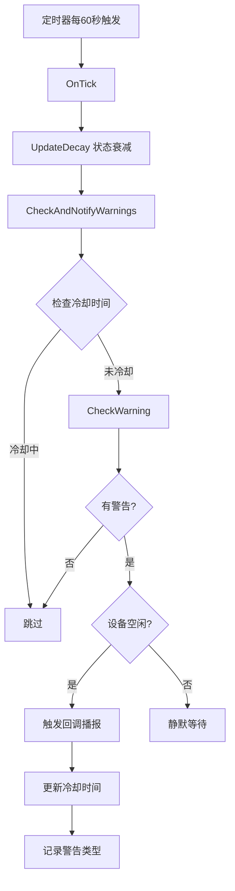

# 🐾 宠物主动播报系统 - 实现说明

## ✨ 功能概述

当宠物的状态（饱腹度、清洁度、心情）低于阈值时，小智会**主动播报**提醒用户，而不是被动等待用户询问。

### 📢 播报示例

```
主人，我发现🐼熊猫有点饿了，可能需要喂点食物了。
主人，🐱猫咪需要清洁一下了，不然它会不开心的哦。
主人，🐶小狗最近有点不开心，可能是太久没陪它玩了。要不要陪它玩一会儿？
```

---

## 🎯 核心设计

### 1. 警告阈值 (在 `pet_system.h` 中定义)

```cpp
static constexpr int WARNING_SATIETY_THRESHOLD = 30;     // 饱腹度低于30%警告
static constexpr int WARNING_CLEAN_THRESHOLD = 25;       // 清洁度低于25%警告
static constexpr int WARNING_MOOD_THRESHOLD = 35;        // 心情低于35%警告
static constexpr int WARNING_COOLDOWN_MIN = 15;          // 15分钟警告冷却
```

### 2. 优先级策略

按照重要性排序：
1. **饱腹度** > 2. **清洁度** > 3. **心情**

只播报优先级最高的问题，避免同时提示多个问题。

### 3. 冷却机制

- **时间冷却**：同一警告类型间隔15分钟才能再次播报
- **类型冷却**：记录上次警告类型，避免重复播报同一问题
- **状态检测**：只在`kDeviceStateIdle`（空闲）状态下播报，不打断对话

---

## 🔧 技术实现

### 核心函数

#### 1. `CheckWarning()` - 检查并生成警告消息

```cpp
std::string PetSystem::CheckWarning() {
    // 检查优先级：饱腹度 > 清洁度 > 心情
    if (state_.satiety <= WARNING_SATIETY_THRESHOLD) {
        // 生成饥饿警告消息
    } else if (state_.cleanliness <= WARNING_CLEAN_THRESHOLD) {
        // 生成清洁警告消息
    } else if (state_.mood <= WARNING_MOOD_THRESHOLD) {
        // 生成心情警告消息
    }
    return message;
}
```

#### 2. `CheckAndNotifyWarnings()` - 通知警告

```cpp
void PetSystem::CheckAndNotifyWarnings() {
    // 1. 检查冷却时间（15分钟）
    if (time_since_last_warning < WARNING_COOLDOWN_MIN) {
        return;
    }
    
    // 2. 获取警告消息
    std::string warning = CheckWarning();
    
    // 3. 触发回调
    if (!warning.empty()) {
        warning_callback_(warning);
        lastWarningMs_ = now;
        lastWarningType_ = current_warning_type;
    }
}
```

#### 3. Application 集成

```cpp
pet_system.SetWarningCallback([this, display](const std::string& message) {
    // 只在空闲状态下播报
    if (device_state_ == kDeviceStateIdle) {
        Schedule([this, display, message]() {
            display->SetChatMessage("system", message.c_str());
            display->SetEmotion("thinking");
            audio_service_.PlaySound(Lang::Sounds::OGG_NOTIFICATION);
        });
    }
});
```

---

## ⏱️ 触发时机

### 定时检查

- **频率**: 每1分钟检查一次（由 `OnTick()` 调用）
- **流程**: 
  ```
  OnTick() → UpdateDecay() → CheckAndNotifyWarnings()
  ```

### 状态衰减后触发

宠物状态每分钟自动衰减：
- 饱腹度: -1/分钟 × 宠物饥饿率
- 清洁度: -1/分钟 × 宠物脏污率
- 心情: -1/分钟 × 宠物心情衰减率（无互动时）

---

## 🎨 播报内容示例

### 饱腹度低

| 状态 | 消息模板 |
|------|----------|
| 15% 以下 | "主人，我发现{emoji}{name}快要饿坏了！它已经很久没吃东西了，需要马上喂食。" |
| 15-30% | "主人，我发现{emoji}{name}有点饿了，可能需要喂点食物了。" |

### 清洁度低

| 状态 | 消息模板 |
|------|----------|
| 15% 以下 | "主人，{emoji}{name}已经很脏了，它可能感觉很不舒服，我们给它洗个澡吧？" |
| 15-25% | "主人，{emoji}{name}需要清洁一下了，不然它会不开心的哦。" |

### 心情低

| 状态 | 消息模板 |
|------|----------|
| 30分钟以上无互动 | "主人，{emoji}{name}最近有点不开心，可能是太久没陪它玩了。要不要陪它玩一会儿？" |
| 其他情况 | "主人，我觉得{emoji}{name}心情不太好，可能需要你的关注和陪伴。" |

---

## 🔄 工作流程



---

## 📝 日志输出

### 启动时
```
I Pet: Pet warning callback registered
```

### 触发警告时
```
I Pet: 🔔 Triggering pet warning: 主人，我发现🐼熊猫有点饿了，可能需要喂点食物了。
I Application: 🐾 Pet warning: 主人，我发现🐼熊猫有点饿了，可能需要喂点食物了。
```

---

## ⚙️ 可配置参数

### 调整警告阈值

编辑 `main/pet_system.h` 中的常量：

```cpp
// 更严格（提前预警）
static constexpr int WARNING_SATIETY_THRESHOLD = 40;    // 从30改为40
static constexpr int WARNING_MOOD_THRESHOLD = 45;       // 从35改为45

// 更宽松（减少打扰）
static constexpr int WARNING_SATIETY_THRESHOLD = 20;    // 从30改为20
static constexpr int WARNING_COOLDOWN_MIN = 30;         // 从15改为30分钟
```

---

## 🎭 与AI对话的区别

### 传统方式（被动）
```
用户: "我的宠物怎么样？"
AI: "你的🐼熊猫有点饿了，需要喂食。"
```

### 主动播报（新）
```
【15分钟后，小智主动说】
小智: "主人，我发现🐼熊猫有点饿了，可能需要喂点食物了。"
```

---

## 🚀 使用效果

### ✅ 优点
1. **更有生命力** - 宠物像真实存在，会"呼唤"主人
2. **减少遗忘** - 不需要记得查看宠物状态
3. **自然互动** - 像养真实宠物的提醒
4. **不打扰** - 只在空闲时播报，有冷却时间

### 📊 示例场景

#### 场景1：忘记喂食
```
早上8:00 - 用户和小智聊天，喂了宠物
中午12:30 - 饱腹度降到28%
          → 触发警告："主人，我发现🐶小狗有点饿了..."
          → 播放通知音效
```

#### 场景2：长时间不互动
```
周一早上 - 用户和小智互动
周一晚上 - 用户忙碌，没有互动
周二中午 - 心情降到33%，距离上次互动20小时
         → 触发警告："主人，🐱猫咪最近有点不开心，可能是太久没陪它玩了..."
```

#### 场景3：冷却保护
```
14:00 - 播报饥饿警告
14:10 - 饱腹度还是很低（用户没喂食）
      → 不播报（15分钟冷却中）
14:20 - 饱腹度还是很低
      → 不播报（15分钟冷却中）
14:16 - 冷却结束，如果还低于阈值会再次播报
```

---

## 🔮 未来扩展

### 可选增强功能
1. **语音播报** - 使用TTS直接语音提醒
2. **分级提醒** - 多级阈值（提示 → 警告 → 紧急）
3. **时间智能** - 夜间降低提醒频率
4. **个性化** - 根据宠物性格调整提醒方式
5. **状态预测** - "再过20分钟宠物会饿..."

---

## 📦 代码文件清单

```
main/
├── pet_system.h          # 接口定义 + 阈值配置
├── pet_system.cc         # 警告检测实现
└── application.cc        # 播报回调注册
```

### 关键修改点

| 文件 | 行数 | 内容 |
|------|------|------|
| `pet_system.h` | 174-184 | 添加警告回调接口 |
| `pet_system.h` | 227-230 | 添加警告状态变量 |
| `pet_system.h` | 244-248 | 定义警告阈值常量 |
| `pet_system.cc` | 272 | OnTick中调用检查 |
| `pet_system.cc` | 792-874 | 实现警告检测逻辑 |
| `application.cc` | 435-446 | 注册播报回调 |

---

## 🎉 完成！

电子宠物系统现在具备了**主动关怀能力**，小智会像一个贴心的宠物管家，在宠物需要照顾时主动提醒你！

### 测试方法

```cpp
// 1. 快速测试 - 手动设置低状态
pet_system.DebugSet(70, 25, 70);  // 饱腹度25%，会触发警告

// 2. 自然测试 - 等待30分钟+，不互动，观察播报
```

---

**版本**: v1.0  
**创建日期**: 2025-01-23  
**作者**: AI Assistant  
**关联文档**: `电子宠物_v2.0_完成.md`

